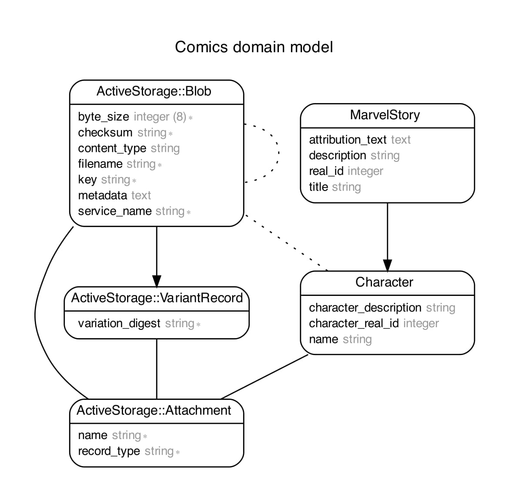

# Learning Assessment
## Comics
### Project Requirements are in The Comics Test.pdf File


The aim is to express my level of skills and knowledge as they are required to deal with everyday tasks.
To achieve this purpose, I completed all tasks while keeping in mind the task definition.

Solution:
* I used Ruby on Rails Framework for Development.
* Ruby (Version: 2.7.1)
    * CMD (bundle install)
* Rails (Version: 6.1.5)
* Database - Postgres
* Database creation
* Database initialization
    * CMD (rake db:setup)
    * I added initial records in db:seed

* For Test Cases I used (Rspec and Capybara)
* How to run the test suite
    * CMD (bundle exec rspec spec)

* Running instructions:
    * CMD (rails s)
    * View on any Web using localhost:3000
    
# If wish to Run the Rails Application using Docker
##### First need to Uncomment 3 lines in database.yml
##### Which includes host, username, and password.
##### Then run these commands:

```
docker compose build
docker-compose run web rake db:create
docker-compose run --rm web bundle exec rake db:migrate
docker-compose run --rm web bundle exec rake db:seed
docker compose up
```
*PS: If you're using MAC then it cause an issue in "apt-get update" cmd in Docker, the solution to this problem is going to "Screen Time" setting and change the settings to "Unrestricted web access".


# Otherwise Run the Rails Application using without Docker

Bundle install

rake db:setup

host: localhost -> host: database

Please Visit Localhost:3000

## Overview

Here Rails applications has two models according to the following database scheme.
* MarvelStory has_many Characters. (It can easily achieve with only one model as well but i beleives that Characters should be in another object so it must have another class.)



1. `Get on the basis of Story ID:`

    http://localhost:3000/marvel_stories/fetch_story?character_real_id=&story_name=&story_id=477&commit=Apply

   

2. `Get on the basis of Character Name and Story Exact Title`

    http://localhost:3000/marvel_stories/fetch_story?character_real_id=1009182&story_name=Cover+%23477&story_id=&commit=Apply


If data is wrong:
    http://localhost:3000/marvel_stories/fetch_story?character_real_id=1009182&story_name=Cover+%23477&story_id=&commit=Apply


## That's ALL, Folks!

###

##### *** In case something isn't clear or any issue while setup, feel free to contact me. Email Address: hamidiqbal598@gmail.com

## GOOD BYE